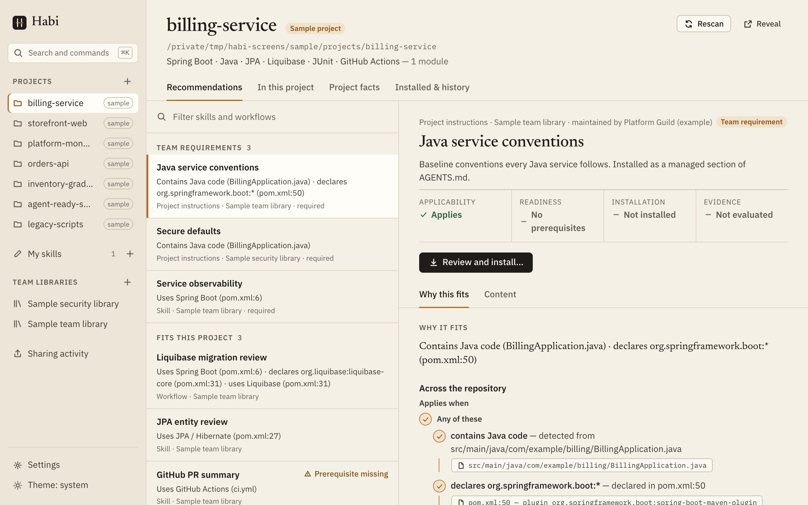

# Habi

**Find what applies. Improve what works. Share what you learn.**

[](https://github.com/acltabontabon/habi/actions/workflows/ci.yml)
[](LICENSE)

Developers who work with AI coding agents keep learning useful things: a review checklist
that catches what the old one missed, a script that makes a migration safe, the instruction a
skill was lacking. Most of it stays on one machine. Habi is a local knowledge layer for that
work. It brings the skills and instructions that already exist — yours, your team's, the
community's — into the project you are working on, and carries what you refine there back to
where the next developer will find it.



Knowledge lives in several places; Habi keeps them apart and presents them as one layer:

| | |
|---|---|
| **My skills** | Yours, on this machine: drafts, experiments, edited copies. |
| **Team libraries** | Git repositories your team curates and reviews. |
| **Community libraries** | Published by others and not reviewed by your team. |
| **The project** | The repository you are working in: what it already contains, and which of the above applies to it. |

- **Find.** Open a repository; Habi shows which skills and instructions apply and *why*, down
  to the file and line. It reads build files and structure only — nothing is built or run.
- **Apply.** Install for the agent tools you already use (Claude Code, Cursor, Codex) with a
  preview of every file. Every install, update or removal is a reviewed plan that can be
  restored.
- **Refine.** Edit a copy as a complete package — instructions, scripts, references, assets.
  It remembers where it came from, so your changes stay connected to the original.
- **Share.** Send the refinement to a team library as a pull or merge request, read the
  review in Habi, and revise on the same request. Without a host integration, export a patch.
- **Reuse.** Teammates get it when they refresh. Installed copies update three ways, so local
  adaptations are kept and conflicts are explained.

Principles:

- **Honest about evidence.** "Applies", "needs information" and "does not apply" are kept
  apart, and so are readiness, installation and evidence. Unknown is a valid answer.
- **Standard formats.** Skills are ordinary [Agent Skills](https://agentskills.io) folders;
  shared instructions go into `AGENTS.md`. Habi metadata is an optional sidecar; everything
  keeps working without Habi.
- **Local.** No account, no telemetry, no cloud service, no model calls. Git uses your existing
  credentials.

A repository and an idea are enough to start; libraries are optional.

> **Status: pre-release (0.1.0).** There are no prebuilt downloads yet — build from source
> (below). See [what is verified](docs/implementation-status.md) and the
> [release blockers](docs/release.md#release-blockers-current).

## Try it

You need [Rust](https://rustup.rs) (the exact version installs itself from
`rust-toolchain.toml`), [Node.js](https://nodejs.org) 24 or newer, Git, and the
[Tauri prerequisites](https://v2.tauri.app/start/prerequisites/) for your system (on macOS:
`xcode-select --install`).

```sh
git clone https://github.com/acltabontabon/habi.git
cd habi/apps/desktop
corepack enable          # provides the pinned pnpm version
pnpm install
pnpm tauri dev           # the first build takes a few minutes
```

When the window opens, choose **Explore a sample workspace** to see two example libraries
matched against seven example projects (all labeled as samples), or **Open a project…** to
start with your own repository. Nothing in your project changes until you review and confirm
a plan.

### Command line

```sh
cargo install --path crates/habi-cli       # puts `habi` on your PATH

habi source add Team git@github.com:your-team/skills.git --branch main
# …or a library folder on this machine (relative paths are fine):
habi source add Local ./fixtures/libraries/example-team-library
# …or a community library (published by others, not reviewed by your team):
habi source add Superpowers https://github.com/obra/superpowers --community
habi source refresh

cd path/to/project                         # any folder inside it works
habi recommend                             # what fits, and why in one line
habi explain liquibase-migration-review    # the full reasoning, and its checks
habi install liquibase-migration-review --client claude-code,cursor
habi status                                # local edits, updates
habi update                                # three-way, previewed
```

Commands find the project from the current folder (nearest `.habi/lock.json`, else the Git
root); `-C <folder>` names it explicitly. Every change is previewed and asks first; `--yes`
skips the question and `--dry-run` only previews. With `--json`, each command prints exactly
one JSON document (errors as `{"error": {"code", "message"}}` with a nonzero exit) and
changes need `--yes`.

Correct what Habi detected, and verify an item with its own check:

```sh
habi declare tag db:jooq --absent --note "migrated away"   # reversible
habi declarations                                          # ids for `habi undeclare <id>`
habi check liquibase-migration-review changelog-is-wellformed        # preview the command
habi check liquibase-migration-review changelog-is-wellformed --run  # run it (asks first)
```

Share an improvement with the library's maintainers:

```sh
habi contribute start Team .claude/skills/my-skill   # or: --item <library item>
habi contribute show <id>                            # what would leave this machine, where to edit
habi contribute describe <id> --title "…" --message "…"
habi contribute commit <id>                          # a branch in Habi's cache; nothing is pushed
habi contribute publish <id> --open-request          # push and open a pull/merge request
```

## For library maintainers

A library is a Git repository (or a subfolder of one) containing skill folders with
`SKILL.md`. To make a skill match projects, add an optional `habi.yaml` next to it:

```yaml
habi: 1
title: Liquibase migration review
applies_when:
  all:
    - tag: framework:spring-boot
    - dependency: org.liquibase:liquibase-core
excludes:
  tag: db:jooq
requires:
  tools:
    - name: Maven
      commands: [./mvnw, mvn]
```

Validate with `habi validate path/to/library`. See [Habi metadata](docs/metadata-schema.md)
and the [example library](fixtures/libraries/example-team-library).

## Documentation

| | |
|---|---|
| [Product contract](docs/product.md) | Principles and what Habi is not |
| [My skills](docs/local-skills.md) | Creating, importing, previewing, using and sharing skills |
| [Architecture](docs/architecture.md) | Crates, modules, data locations |
| [Metadata schema](docs/metadata-schema.md) | `habi.yaml`, `habi-library.yaml`, conditions, versioning |
| [Detectors](docs/detectors.md) | What inspection recognizes and its limits |
| [Client compatibility](docs/compatibility.md) | Claude Code, Cursor, Codex paths, and smoke tests |
| [Contribution flow](docs/contribution-flow.md) | Sharing improvements for review |
| [Security](docs/security.md) | Threat boundaries and residual trust |
| [Recovery](docs/recovery.md) | Journals, rollback, stale caches |
| [Design](docs/design.md) | Visual direction and accessibility |
| [Release](docs/release.md) | Builds, signing, versioning, blockers |
| [Reuse assessment](docs/reuse-assessment.md) | Dependencies and why custom logic exists |
| [Test data](docs/test-data.md) | Fixtures, the sample workspace and the seed script |
| [Website](website/) | The site at acltabontabon.github.io/habi: `pnpm dev` in `website/`; data from `pnpm snapshot` and `scripts/journey.sh` |

## Contributing

Bug reports, ideas and pull requests are welcome — start with [CONTRIBUTING.md](CONTRIBUTING.md).
Please report security problems privately as described in [SECURITY.md](SECURITY.md).

## License

Habi is licensed under the [Apache License 2.0](LICENSE). It bundles third-party software and
fonts under their own licenses; see [THIRD_PARTY_NOTICES.md](THIRD_PARTY_NOTICES.md).
