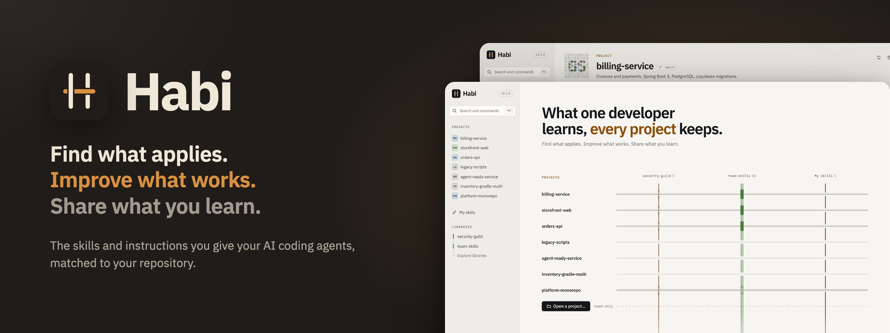
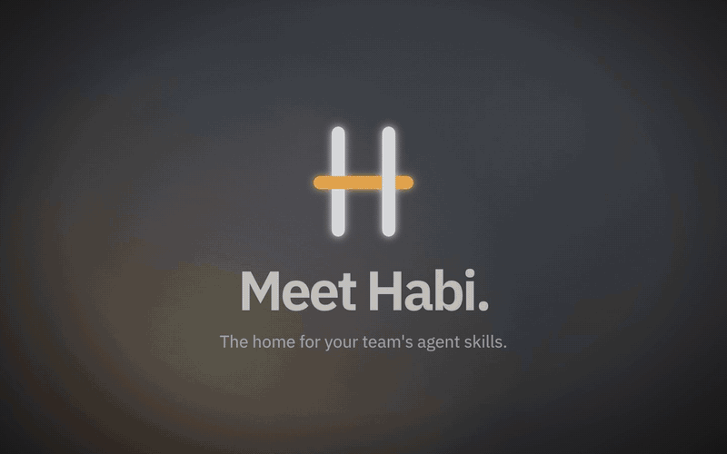
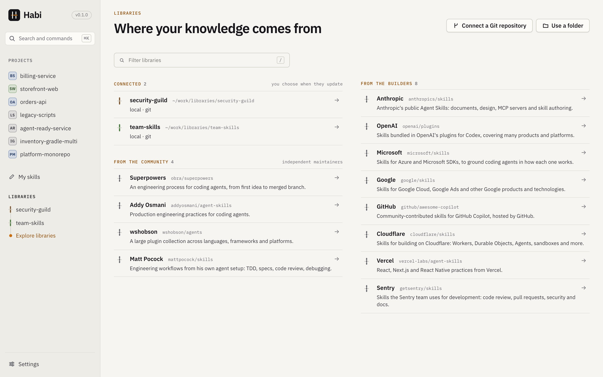
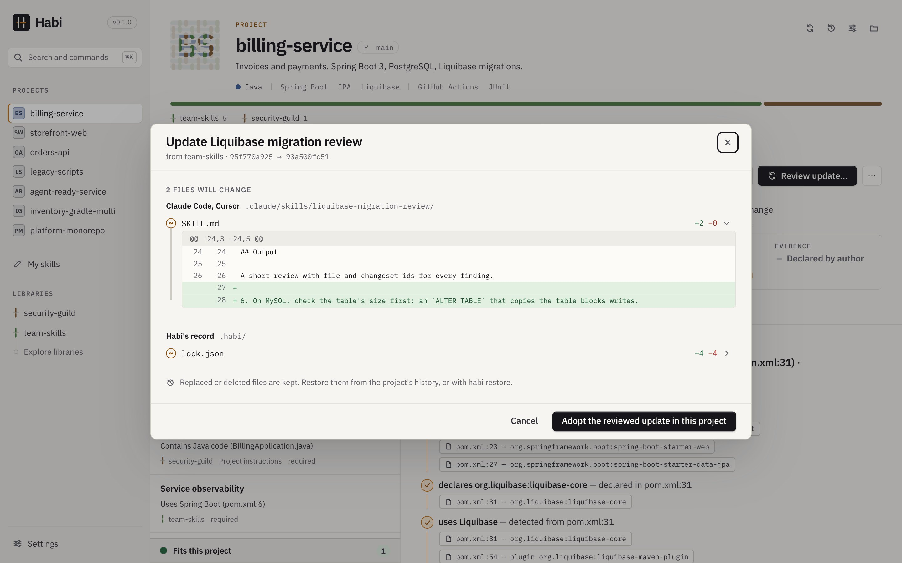

<div align="center">



# Habi

**Find what applies. Improve what works. Share what you learn.**

Habi is a local desktop app for the skills and instructions you give AI coding agents.<br>Open a repository and Habi shows which skills fit it, and why, down to the file and line.

<a href="https://github.com/acltabontabon/habi/releases/latest"></a> <a href="https://github.com/acltabontabon/habi/actions/workflows/ci.yml"></a>  <a href="LICENSE"></a>

<br>

<a href="https://github.com/acltabontabon/habi/releases/latest"><b>Download</b></a> &nbsp;·&nbsp; <a href="https://acltabontabon.com/habi/docs/">Documentation</a> &nbsp;·&nbsp; <a href="https://acltabontabon.com/habi/">Website</a>

<br>

<a href="https://acltabontabon.com/habi/#demo"></a>

</div>

<br>

## What it does

<table>
<tr>
<td width="33%" valign="top">

**Find**<br>
Skills that fit your repo, each with the files and lines behind it. Nothing is built or run.

</td>
<td width="33%" valign="top">

**Install**<br>
For Claude Code, Cursor, Codex, Gemini CLI, GitHub Copilot, OpenCode and Junie, after previewing every file.

</td>
<td width="33%" valign="top">

**Edit**<br>
A copy, locally: the full package with instructions, scripts, references and assets.

</td>
</tr>
<tr>
<td width="33%" valign="top">

**Share**<br>
Send improvements back to a library as a pull or merge request, after seeing exactly what leaves your machine.

</td>
<td width="33%" valign="top">

**Update**<br>
What you installed, in a project or on your machine, after seeing exactly what changed.

</td>
<td width="33%" valign="top">

**Trust**<br>
Every skill shows its author, license and origin. No account, telemetry, cloud service or model call.

</td>
</tr>
</table>

Skills are ordinary [Agent Skills](https://agentskills.io) folders and shared instructions go
into `AGENTS.md`, so everything keeps working without Habi. Git uses your existing credentials.

<br>

<div align="center">

## A look inside

<table>
<tr>
<td width="50%" valign="top"><br><b>Fits, and why</b><br><sub>Every skill matched to the repository, with the files and lines behind it.</sub></td>
<td width="50%" valign="top"><br><b>Every library in one place</b><br><sub>Your team's, the community's and the tool builders'.</sub></td>
</tr>
<tr>
<td width="50%" valign="top"><br><b>See every file first</b><br><sub>Install for seven agent tools; nothing is written until you say so.</sub></td>
<td width="50%" valign="top"><br><b>Updates you choose</b><br><sub>Review exactly what changes, per agent tool, before it is written.</sub></td>
</tr>
<tr>
<td width="50%" valign="top"><br><b>The Skill Studio</b><br><sub>Write a skill as one document and test when it would be suggested.</sub></td>
<td width="50%" valign="top"><br><b>Send it back</b><br><sub>Preview what leaves your machine, then open a pull request.</sub></td>
</tr>
</table>

</div>

<br>

## Install

```sh
brew install --cask acltabontabon/tap/habi
```

Or download the installer from the [Releases page](https://github.com/acltabontabon/habi/releases/latest):
macOS 11 or later (Apple Silicon and Intel) or Windows (64-bit). Linux is not supported.

The installers are not signed by Apple or Microsoft, so the first launch asks you to confirm once
([how](docs/guide/getting-started.md#installing)); updates after that are signed with Habi's own
key. You can also build it yourself ([CONTRIBUTING.md](CONTRIBUTING.md#set-up)). The known
limitations are in the [security model](docs/project/security-model.md#known-limitations).

## Documentation

[Getting started](docs/guide/getting-started.md) walks you through the sample workspace and
your first project. Read the docs on the site at [acltabontabon.com/habi/docs](https://acltabontabon.com/habi/docs/), or
here in [`docs/`](docs/README.md); both are the same pages.

<table>
<tr>
<td width="33%" valign="top">

**Using Habi**

[Getting started](docs/guide/getting-started.md)<br>
[My skills](docs/guide/my-skills.md)<br>
[Sharing](docs/guide/sharing.md)<br>
[Agent tools](docs/guide/agent-tools.md)<br>
[Recovery](docs/guide/recovery.md)

</td>
<td width="33%" valign="top">

**Writing libraries**

[Habi metadata](docs/library-authors/metadata-schema.md)<br>
[Detectors](docs/library-authors/detectors.md)<br>
[Library catalog](docs/library-authors/catalog.md)

</td>
<td width="33%" valign="top">

**The project**

[Product contract](docs/project/product.md)<br>
[Security model](docs/project/security-model.md)<br>
[All pages, including working on Habi](docs/README.md)

</td>
</tr>
</table>

## Contributing

Bug reports, ideas and pull requests are welcome. Start with [CONTRIBUTING.md](CONTRIBUTING.md);
questions go to [SUPPORT.md](SUPPORT.md). Report security problems privately as described in
[SECURITY.md](SECURITY.md).

Habi is maintained by one developer, Alvin Cris Tabontabon, in their own time. Issues and pull
requests are read, but responses are best effort, and security reports come first.

<div align="center">

<br>

<a href="https://ko-fi.com/aclt_attic"></a>

<sub>Habi is licensed under the <a href="LICENSE">Apache License 2.0</a>. It bundles third-party software and fonts under their own licenses; see <a href="THIRD_PARTY_NOTICES.md">THIRD_PARTY_NOTICES.md</a>.</sub>

</div>
