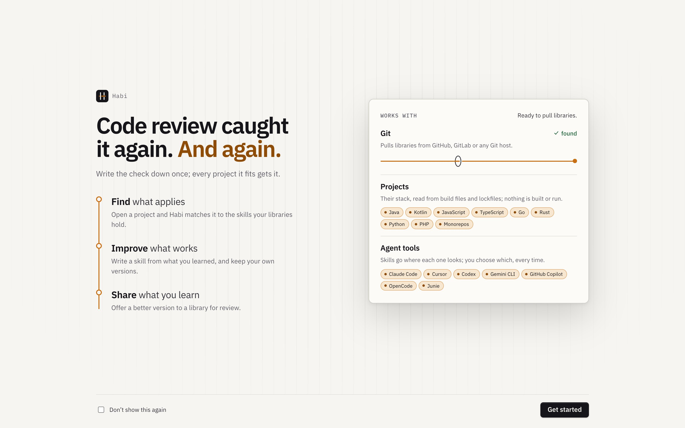
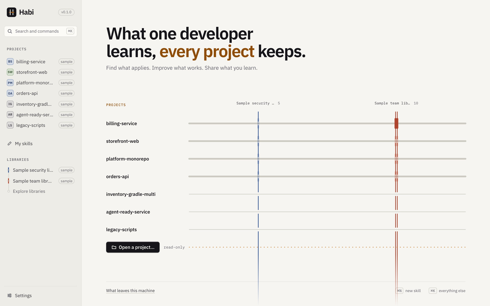
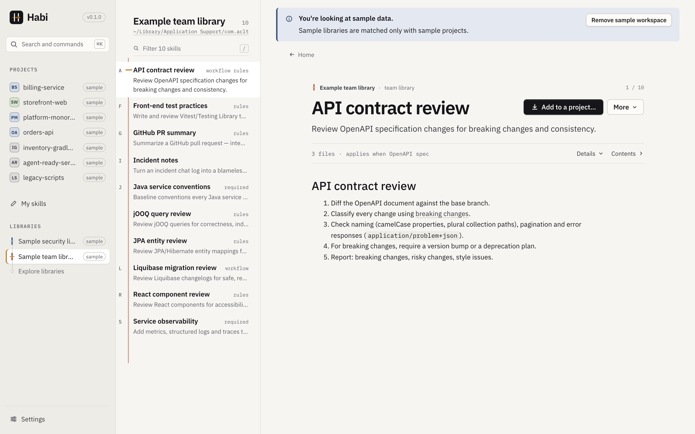
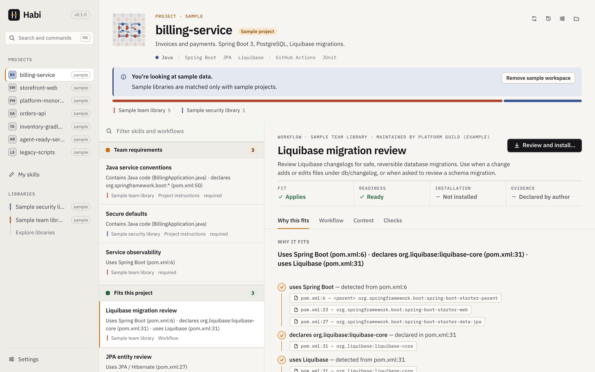
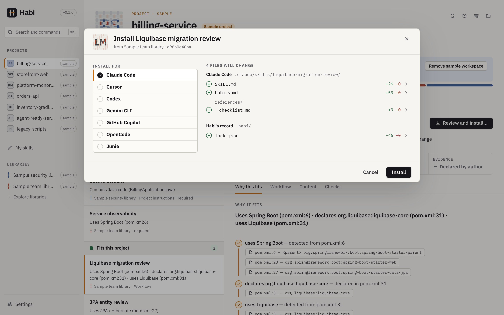
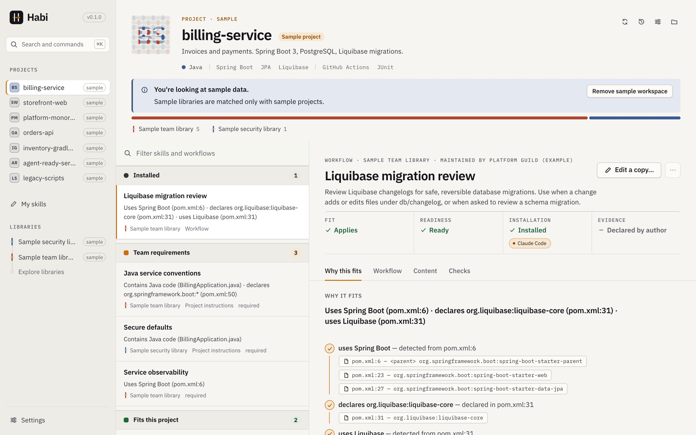

# Getting started

Habi shows which skills and instructions fit the repository you are working in, installs them
for the agent tools you use, and carries what you improve back to the library it came from. It
runs on macOS 11 or later and on Windows.

Shortcuts on this page are written for macOS; on Windows, use Ctrl where it says ⌘.

## Installing

Download the installer for your system from the
[Releases page](https://github.com/acltabontabon/habi/releases): the `universal.dmg` for macOS
(Apple Silicon and Intel), or the `.msi` or `-setup.exe` for Windows. Each release also carries
the `habi` command-line tool.

The installers are not signed by Apple or Microsoft, so the first launch asks you to confirm:

- **macOS:** open Habi once. When macOS says it cannot check it, go to **System Settings →
  Privacy & Security** and choose **Open Anyway** next to Habi. (Or, in Terminal:
  `xattr -dr com.apple.quarantine /Applications/Habi.app`.)
- **Windows:** when SmartScreen says *Windows protected your PC*, choose **More info**, then
  **Run anyway**.

You confirm once. Updates after that are signed with Habi's own key, and checked before they
install. To build Habi yourself instead, see the [README](../../README.md#build-from-source).

## The welcome

When Habi starts, a welcome says what it is for and what it works with. It checks the one
thing Habi needs, Git (to pull libraries), and shows how to install it if it is missing. The
GitHub and GitLab command-line tools are optional: they let Habi open and follow pull and
merge requests on the host you use. Settings → This machine → Command-line tools shows
whether each is installed and how to add it. *Don’t show this again* turns the welcome off;
Settings → This machine → Welcome brings it back.

## Try the sample workspace

While you have no projects, the start screen offers to **try the sample workspace**; it is
also in the command palette (⌘K). Habi creates two example libraries and seven example projects in its own
data folder, all labeled as samples, so you can see recommendations, installs and updates
without touching your own repositories. Sample libraries are matched only with sample
projects, never with yours.

The home page draws your projects across your libraries as a weave. Where a library's skills
fit a project its thread surfaces over the row: solid where something from it is installed
there, washed out where its skills fit but nothing is installed yet. Point at a crossing to see
which.

When you are done, choose **Remove sample workspace** on the banner in any sample project or
library, in Settings → Storage, or in the command palette. It removes only the examples.

## Your first project

1. **Open a project…** (⌘O) and pick a repository folder. Habi reads its build files and
   structure. Nothing is built or run.
2. Without a library, the project shows what is *already here*: the skills and instruction
   files it contains. To get recommendations, **connect a library**: a Git repository your
   team curates (Habi uses your existing Git credentials), a public library from the catalog,
   or a folder on this machine.

   

3. Read the recommendations. Each item says why it fits, down to the file and line, and is
   grouped as *Team requirements*, *Fits this project*, *Needs information*, *Available to use
   manually* or *Does not apply*. When Habi could not establish something (for example, a
   dependency inherited from a parent build file outside the repository), you can answer the
   question; your answer is labeled as yours and can be undone.

   

4. Install an item: check the agent tools Habi preselected (the ones the project already
   uses), review every file that would be created or changed, and confirm.

   

   Installed items move to an **Installed** section at the top of the list, and the item's
   Installation facet shows the agent tools it is installed for; point at one to see where
   its files are.

   

From there, [My skills](my-skills.md) covers writing and editing your own skills, and
[Sharing](sharing.md) covers sending an improvement back for review. Everything here also
works from the [command line](cli.md).

## What Habi changes, and what it does not

In your project, and only after you confirm a plan:

- skill folders under `.claude/skills/` or `.agents/skills/`;
- a managed section in `AGENTS.md`, and an import line in `CLAUDE.md` or `GEMINI.md`;
- MCP server entries, only if you ask for them;
- `.habi/lock.json`, which records what Habi installed. Commit it or ignore it.

On this machine, only when you install a skill there: a skill folder under `~/.claude/skills/`
or `~/.agents/skills/`, and `~/.habi/lock.json`.

[Agent tools](agent-tools.md) lists exactly where each file goes. Every install, update or
removal is journaled; in a project, any of them can be restored. See [Recovery](recovery.md).

Habi never:

- runs builds, package managers, scripts or Git inside your project to inspect it;
- changes your checkout or branches (contributions are prepared in Habi's own copy of the
  library);
- sends anything off your machine unless you share, push or open a request and confirm it;
- uses an account, telemetry or a cloud service.

Refreshing a library never changes a project. Habi's own data (library caches, journals,
logs, its database and My skills) lives in its data folder, which Settings → This machine →
Data folder shows:

| System | Data folder |
|---|---|
| macOS | `~/Library/Application Support/com.acltabontabon.Habi` |
| Windows | `%APPDATA%\acltabontabon\Habi\data` |

Habi makes a few network requests on its own, such as checking for a newer version; the
*Privacy and security* page in the app and the
[security model](../project/security-model.md#network-requests-habi-makes-on-its-own) list them. Settings →
Updates turns the automatic checks off.

## Removing Habi

Removing the app does not touch projects: installed skills, `AGENTS.md` sections, MCP entries
and `.habi/lock.json` are ordinary files that stay and keep working. Habi's data folder and
`~/.habi/` stay too; delete them by hand if you no longer want them.
