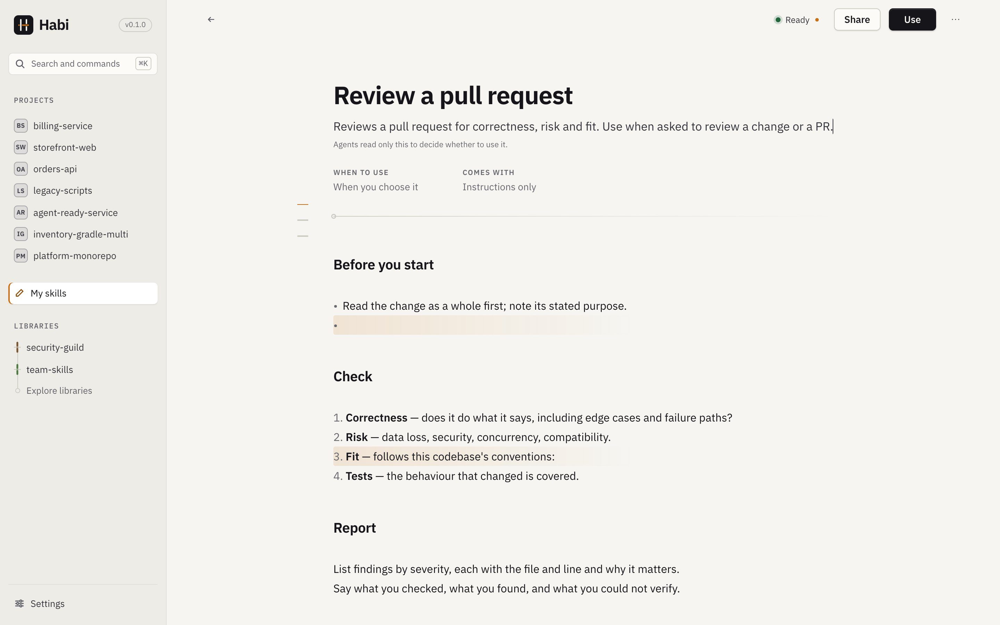

# My skills

Write your own skills, edit others', test them against projects—all offline, no account or
model needed. When ready, use in a project or on your machine. Share when it's worth sharing.

## What is where, and who owns it

| Thing | Where it lives | What Habi does with it |
|---|---|---|
| A skill **in a project** (`.claude/skills/…`, `.agents/skills/…`, any folder with `SKILL.md`) | The project, untouched | Lists it under *Already here* and lets you read it, copy it or turn part of it into a skill. |
| An **instruction file** (`AGENTS.md`, `CLAUDE.md`, `GEMINI.md`, Cursor and Claude rules, Copilot instructions) | The project, untouched | Lists it with its sections. You can copy a part into a draft; the file is never rewritten by this. |
| A skill **on this machine** (`~/.claude/skills`, `~/.agents/skills` and each tool's own folder) | Your home folder | Lists it under *On this machine*. Habi changes only the skills it installed there. |
| A skill in **My skills** (a draft, or a copy) | `<data>/skills/<id>/package/`, a plain Agent Skills folder | Yours to edit. Not installed or shared until you choose. |
| A skill in a **library** | Habi's read-only copy of the library | Never edited in place. *Edit a copy…* makes an attributed copy in My skills; your edits go back through a reviewed contribution. |
| An **installed copy** | The project, or your home folder | Written only through a reviewed plan. Editing your skill afterwards does not change it; the change shows as an update. |

`<data>` is Habi's data folder; Settings → This machine → Data folder shows where it is.

## Creating a skill

**New skill** opens a blank page. Habi auto-names it from your content: the first heading
becomes the title, and the title becomes the identifier (until you change it or install).
*Use the opening line* sets the purpose from your opening sentence.

## The Skill Studio

Edit three layers of your skill:

**Instructions** — Markdown as a document. Type freely; headings, code, and file references
are highlighted. Starters are available for new skills.

**When to use** — Define signals (conditions that trigger recommendations). Examples:
- *Playwright is used*
- *Depends on `@playwright/test`*
- File patterns

Also set exceptions (*Avoid when*), scope (*Check within*), and required tools. These write
`habi.yaml` for recommendations. See [Habi metadata](../library-authors/metadata-schema.md).

**Materials** — Scripts, examples, references, assets. Say what each does in your instructions.
Files are auto-organized by type; scripts are stored but never run.

**Skills without signals** are manual only—never recommended. Habi never auto-adds signals;
you choose when to add them.

Top bar shows **Ready** / **Draft** status and actions: **Use**, **Share**, and more (**•••**).

### Readiness

**Ready** or **Draft** opens what is left to do, each item with the way to it: a title, a
purpose, a valid identifier. The identifier is changed deliberately, with *Change the
identifier*.

### Saving & cleanup

Drafts auto-save as you type, on demand, and when you leave. If the file changes outside Habi,
you choose which version to keep.

*Move to trash* can be restored later; *Delete permanently* is separate and confirmed.

## Testing against a project

Choose a project to test your signals against using the same matcher as recommendations:

- **Would be suggested here** — signals matched with evidence (files and lines)
- **Would not be suggested here** — signal failed or exception triggered
- **Can’t tell yet** — missing info (e.g., inherited dependencies outside the repo)

Verdict is about rules only—not skill quality or agent behavior.

## Checks

Habi runs the same checks on every package it reads: library items, My skills, contributions
and `habi validate`. Each problem has a level:

- **Error.** Blocks installing, exporting and sharing a skill from My skills, and preparing a
  contribution. A library item with errors stays listed, with its problems shown.
- **Warning.** Should be fixed; nothing is blocked.
- **Info.** A suggestion, or something that was not checked (and why).

| Check | Level |
|---|---|
| `SKILL.md` exists and starts with YAML frontmatter that parses | error |
| `name` is present and valid (lowercase letters, digits, hyphens; 1–64 characters) | error |
| `description` is present | error |
| `name` matches the folder name; `description` is at most 1,024 characters | warning |
| `habi.yaml` parses, matches the schema, has valid conditions, and its checks use declared bindings (otherwise the metadata is ignored as a whole) | error |
| Files named in `workflow.steps[].references` exist | warning |
| Relative links and images in `SKILL.md` and the other `.md` files (except under `assets/`, where Markdown is usually a template) point to a file or folder in the skill. Targets resolve from the folder of the file that contains them; `#fragment` and `?query` are ignored. | warning, naming the file and the missing path |
| A relative link that climbs out of the skill (`../shared/README.md`) | warning: it will not resolve once the skill is installed or shared on its own |
| Inline code that is plainly a package path (`scripts/…`, `references/…` or `assets/…`, with no spaces, wildcards, placeholders or line numbers) names a file in the skill | warning |
| `.json` files parse (comments and trailing commas, as in `tsconfig.json`, are accepted) | warning, with the parser's message |
| `.yaml` and `.yml` files other than `habi.yaml` parse, with the same limits as `habi.yaml`; several documents in one file are fine | warning, with the parser's message |
| A text file too large to scan (over 512 KiB; YAML over 256 KiB), or a `.json` or `.yaml` file that is not UTF-8 | info (not checked) or warning |
| The `SKILL.md` body is very long | info |
| Symbolic links or oversized files (the package would be incomplete) | error |
| My skills only: another of your skills uses the same identifier | error |
| My skills only: the instructions are empty, or a file looks like it contains a secret (an error when sharing) | warning |

The link check is deliberately conservative: URLs (`https:`, `mailto:` and any other scheme),
`#anchors`, absolute and home paths, templated targets (`{{…}}`, `*`, `$`), fenced code
blocks, inline code containing link syntax, HTML comments and footnotes are never reported.

**Scripts are not checked.** Habi does not parse, lint or run them, not even with a syntax check
such as `bash -n`, because that would execute or interpret package content.

Passing every check proves neither security nor correctness. The checks catch structural
mistakes before someone else trips over them.

## Adding existing skills

**Add skills** lists where skills can come from. Habi inspects first and writes nothing until
you choose.

1. **A project you opened.** The skill folders found there.
2. **A folder on this machine.** One skill, or a folder of skills such as your personal ones.
3. **A Git repository**, two different ways:
   - *Make my own copy* reads the repository once, copies what you choose, and connects
     nothing. Each copy remembers the repository and the version.
   - *Connect as a library* keeps it to browse and update from. Nothing is copied.
4. **A library you connected.** Copies stay linked to it, so you can review its updates.

The inspection lists each package with its origin, files, license, whether it has rules for
when it applies, and any problems. Importing copies packages byte for byte (references,
scripts with their executable bit, assets and unknown frontmatter included) and records where
each came from. Originals are never changed.

- **Same content already imported:** not selected by default. You can still add a second copy
  under a new identifier.
- **Same identifier, different content:** imported only under a new identifier, so both are
  kept.
- **Incomplete packages** (symbolic links, oversized files): shown, not importable. A partial
  copy would silently lose content.

### Turning instructions into a skill

In a project, *Already here* lists the instruction files. *Turn part into a skill…* shows a
file with its sections: select a section or a range of lines, and the draft's body is that
text, with its origin (file, lines, project) recorded in the draft and in
`metadata.derived-from`. The instruction file stays exactly as it is.

Rules every change must follow belong in the instruction file, where agents always read them.
A skill is loaded only when it is relevant.

## Where it came from, and updates

A copy keeps its files as they were when it was copied, or when it last took an update. Once
it differs, the head says *changed here*. *Where it came from* opens the original, when it was
imported, what you changed (as parts of the skill: *Instructions*, *When to use*, a file), a
newer version in the library if there is one, the projects it is installed in, and the ways to
pass it on. This keeps working after the repository or library is gone.

When the library's version changes, My skills and the skill say so. **Review the update…**
compares three versions of every file: as copied, the library's now, and yours. Files only the
library changed are taken, files only you changed are kept, and a file changed on both sides
needs your choice (*Keep mine* or *Take the library's*) before anything is written. If the item
was removed, the library is not connected, or the copied version is no longer cached, the skill
says so and offers nothing.

## Using a skill

**Use** chooses where the skill goes:

- **In a project.** Habi lists your projects with what the skill's rules say about each, then
  opens the usual review: check the agent tools Habi preselected, see every file that would be
  created or changed, and confirm. Notes for the chosen tools appear in the review.
- **On this machine.** The same review, for your own skill folders (see below).

Valid skills in My skills also appear in each project's recommendations, with *My skills* as
the source, matched by their rules like library items.

Installed means the files are where the agent looks. It does not mean the agent loaded or
followed them.

## On this machine

*On this machine*, in My skills, lists the skills in your own skill folders (`~/.claude/skills`,
`~/.agents/skills`, and each tool's own folder such as `~/.cursor/skills`), with which tools
read each one and, where a project holds a copy too, which copy a tool uses. A skill in
several of those folders (installed for Claude Code and Codex, say, it is in both
`~/.claude/skills` and `~/.agents/skills`) is one entry: its folders are listed together, and
a row of agent tools lights up the ones that read it. Habi only reads
skills it did not install: *Add to My skills* copies one in, and *Use in a project…* installs
it in a project. The original is never touched.

To install a skill there on purpose, choose *Add to this machine…* on a library skill, or **Use
→ On this machine…** on one of yours. The review lists every file under your home folder
before anything is written. Skills Habi installed say so and name their library, with
*Update…* and *Remove from this machine…*. Each of these is journaled like a project install,
but no screen offers to restore one yet. [Agent tools](agent-tools.md#install-on-your-machine)
lists the folders, the record Habi keeps and which copy each tool uses.

## Sharing

The share action on a skill is **Share…** for a skill you wrote, **Share your version…** for a
copy, and **Contribute to *library*…** for a skill copied from a connected library. It sends
the skill to a library as a reviewed contribution: choose the library (or connect one), review
exactly the files that would leave this machine, prepare a branch in Habi's own copy of the
library, then push it and open a pull or merge request. With no Git library connected, *Export
as zip…* writes the skill as a file you can send or commit anywhere.

[Sharing](sharing.md) covers every step, and what each status means.

## Not included

- Running a skill, or watching an agent use it.
- AI-assisted drafting. Editing, matching and testing are deterministic and work offline.
