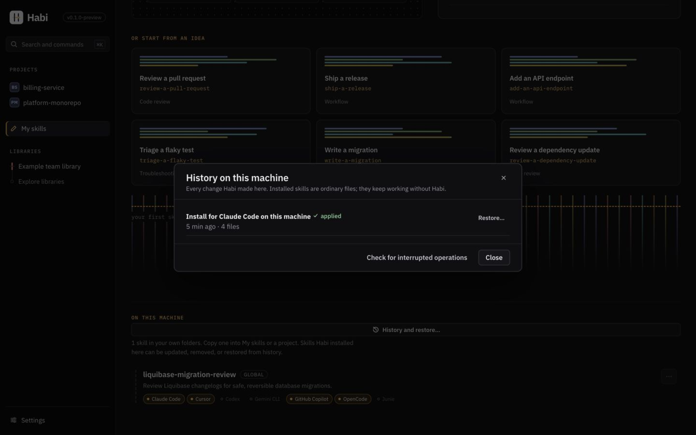

# Recovery

Every change to projects and personal skill folders is journaled and can be undone.
Interrupted changes roll back automatically before the next operation.

Open a project's **History**, or **My skills → On this machine → History and restore…**
for personal skill installs (`~/.claude/skills`, `~/.agents/skills`). Choose **Restore…** to
review the files before anything changes. History remains available after the last personal
skill is removed. Both screens offer **Check for interrupted operations**.



(`<data>` = Habi's data folder; see Settings → This machine → Data folder)

## How changes are applied

Habi uses a write-ahead journal (`<data>/journal/`) for safety:

1. Lock the project
2. Rollback any crashed operations
3. Verify preconditions (if changed → `stalePlan`, abort)
4. Backup files in blob store, journal state = `applying`
5. Apply changes with atomic file replacement
6. Journal state = `committed`

**Failure scenarios:**

| What goes wrong | What happens |
|---|---|
| Step fails (permissions, disk full) | Completed steps undone; journal → `rolledBack` |
| Process crashes mid-apply | Next operation undoes it, or use *Check for interrupted operations* |
| File changes after Habi writes it (before undo) | Left as-is, reported; journal → `needsAttention` |
| You restore a completed operation | Built as new plan; conflicts appear if files changed |
| Only file's executable bit changed | Restore puts the bit back (tracked in journal) |

The lock file is written last, so interrupted applies never record unwritten files.
Files are flushed before replacement. On Unix, directory flush failures are reported too,
including the entries for newly created parent directories. Windows does not flush directory
entries here, so survival across sudden power loss is not guaranteed. Filesystems, hardware
and storage failures can limit these guarantees on every platform. Keep a separate backup
of original work; a journal on the same disk is not a backup against disk failure.

## Restoring & the lock file

Restore recomputes `.habi/lock.json` (doesn't restore it as-is) to handle overlapping changes:

- Items unchanged by restore → keep current entries
- Items changed again later → stay current (preview shows this)
- All others → go back to pre-operation entries
- Only files actually on disk are recorded; deleted files are unlisted

Restoring a case-only rename (`checklist.md` → `Checklist.md`) renames the file back, also on
case-insensitive filesystems (macOS, Windows default), where both names are the same file.

## MCP updates

An update adopts changed server definitions and removes servers the item no longer needs. A
server the item suggests only now is never added unasked: the update preview lists it under
*New MCP server* with *Add the suggested MCP configuration* (off by default). Items
installed without MCP configuration are not offered any.

## Libraries

| Situation | What happens |
|---|---|
| A network or sign-in failure on refresh | The last good snapshot stays; the library is marked stale with the error and its time. |
| Interrupted fetch | Git's own atomic ref updates leave the bare cache usable; the next refresh retries. |
| Corrupted cached content | Blob reads verify SHA-256; corruption is reported and a refresh restores the content. |
| Corrupted snapshot metadata | Reported with a prompt to refresh the library; other libraries are unaffected. |
| A tag moved or history was rewritten | A warning on the library; updates must still be reviewed before they are applied. |

## Local database

- Migrations run in transactions. Before migrating an existing database, Habi keeps a copy
  (`habi.db.pre-v<N>.bak`). A failed migration leaves the previous database unchanged.
- A database written by a newer Habi is refused rather than modified. Move it aside to start
  fresh (projects and installed files are unaffected; connect your libraries again).
- Nothing in the database is needed for installed skills to work.

## Projects

- A moved or deleted project shows as *missing*; Habi does not recreate it.
- Malformed manifests mark coverage as failed with the reason; inspection continues.
- A malformed `.habi/lock.json` blocks install/update with a clear message instead of being
  overwritten.

## Freeing space

Habi keeps each project's newest 20 operations, so they can be restored, and each library's
newest 20 earlier snapshots, and tidies up after installs. **Settings → Storage → Free up
space** removes anything older at once, along with stored file versions nothing refers to.
Unfinished operations and ones that need attention are always kept, and a project or library
another operation is using is skipped until the next run.

## No destructive resets

Do not delete Habi's data folder as a troubleshooting step. Installed project files keep
working independently, but the data folder contains original drafts, imported editable
skills, contribution staging, history and backups. Some of those may be the only copies.
Preserve the whole folder before attempting recovery.

## Back up and restore all local data

An operation restore only undoes project or personal installs. A complete data backup also
keeps My skills, trash, contribution drafts, the database, blobs and journals together.
Before upgrading or repairing Habi:

1. In **Settings → This machine → Data folder**, find the data folder. Quit Habi and stop
   every Habi CLI command. Keep them closed during backup and restore.
2. Copy the **entire** data folder to a separate location, preferably on a different disk.
   Do not copy just `habi.db` from a running application: SQLite's WAL sidecar can hold
   committed work that is not yet in that file. Never delete sidecars to make a backup work.
3. Keep project files in Git or another backup, and separately back up personal installations
   (`~/.agents/skills`, `~/.claude/skills` and `~/.habi/lock.json`). They live outside the data
   folder and are not included in its backup.

For a verified backup, the source checkout includes a tool requiring Node.js 24 or newer.
From the checkout, supply your actual data folder and a **new** backup folder whose parent
already exists:

```sh
node scripts/data-backup.mjs backup "/path/to/Habi/data" "/path/to/backups/habi-backup" --closed
node scripts/data-backup.mjs verify "/path/to/backups/habi-backup"
```

The tool verifies SQLite integrity and each file's SHA-256, includes empty directories and
executable permissions, refuses links and special files, and checks that the source still
matches after copying. It refuses SQLite sidecars: if they remain after a crash, first open
and close Habi cleanly to let SQLite recover and checkpoint them. If Habi cannot open, keep
all files untouched for diagnosis instead of deleting them. `--closed` records your
acknowledgement that Habi is stopped; it cannot prevent another process being started.

Restore first into a **new** folder:

```sh
node scripts/data-backup.mjs restore "/path/to/backups/habi-backup" "/path/to/habi-restored" --closed
```

The tool verifies the backup before restoring, checks the copied files again, and refuses
an existing destination. While Habi remains closed, rename the current data folder to keep
it, and move the restored folder to the original data location. Launch the same Habi version
that created the backup, or a newer compatible version. Check My skills, contribution
drafts and History before discarding any previous folder. A backup of a newer database cannot
be opened by an older Habi.

Backups contain private local content and are not encrypted by this tool. Store them with
the same care as your projects. Checksums detect accidental damage; they do not establish
who made a backup. Use backups you created and keep their original manifest.

## My skills

| Situation | What happens |
|---|---|
| A draft save fails (disk full, permissions) | The skill shows *Couldn’t save* with a retry and keeps the text on screen; the file on disk is the last successful write (writes are atomic). |
| The app closes or crashes while editing | Edits are written within a second of a pause, on ⌘S (Ctrl+S on Windows), on window blur and when leaving the editor. At most the last moment of typing is lost; the draft reopens from disk. |
| The draft's files were edited outside Habi | The next save pauses as a conflict. Choose *Show the other version* or *Keep mine*; nothing is overwritten until you do. |
| `SKILL.md` no longer parses (hand-edited frontmatter) | The skill says so, overwrites nothing, and offers *Repair it as text*. |
| A draft was moved to the trash by mistake | *My skills → Trash → Restore*. |
| The network is unavailable | Creating, editing, testing, importing from folders and projects, installing and exporting all work. Connecting or refreshing a Git library and sending a contribution fail with a specific error and can be retried; the draft is unaffected. |
