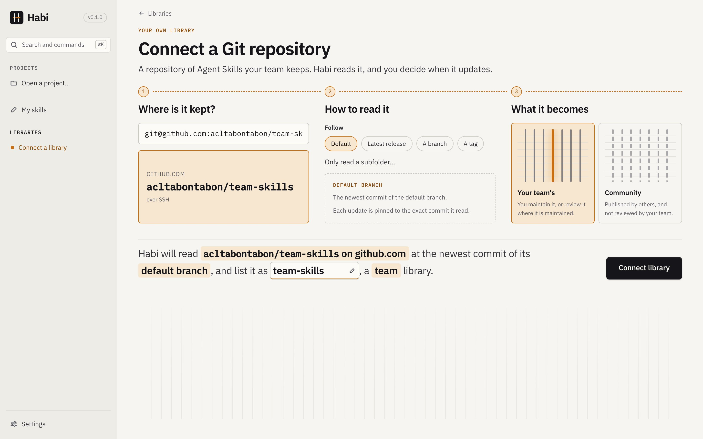
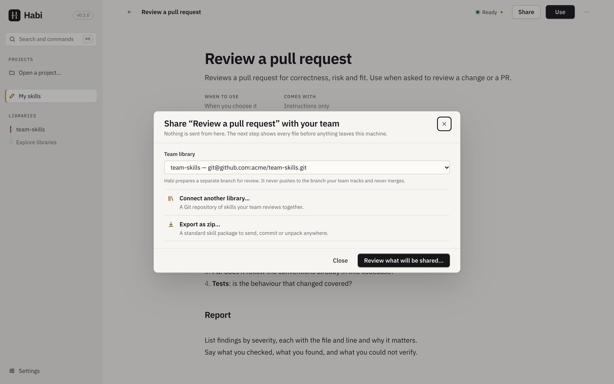
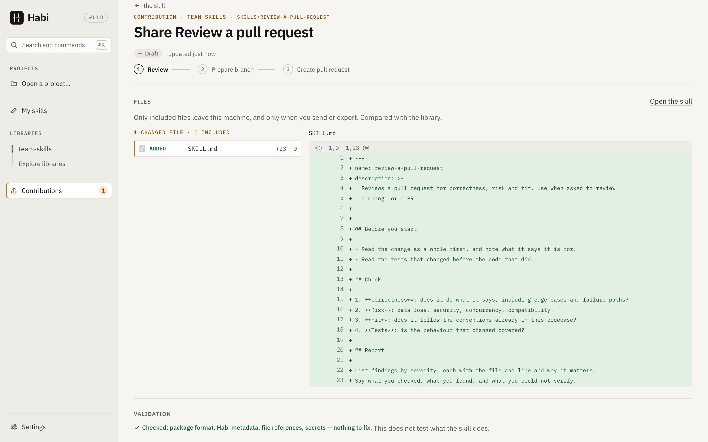
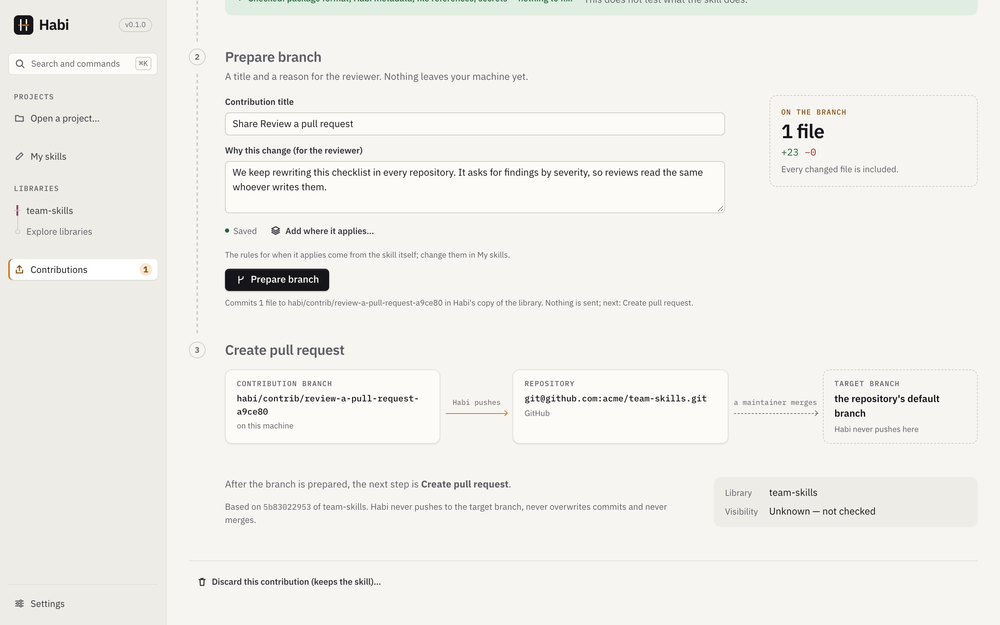
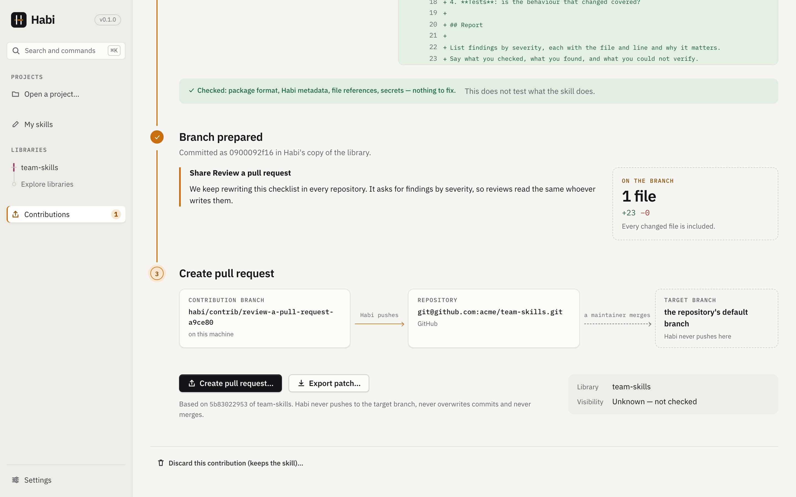
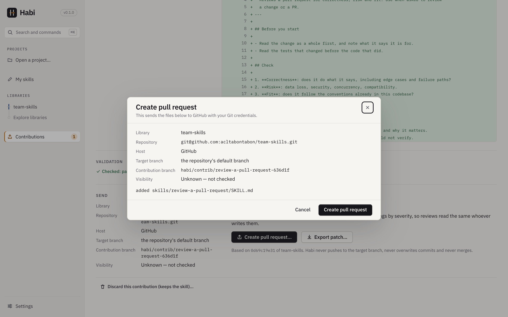
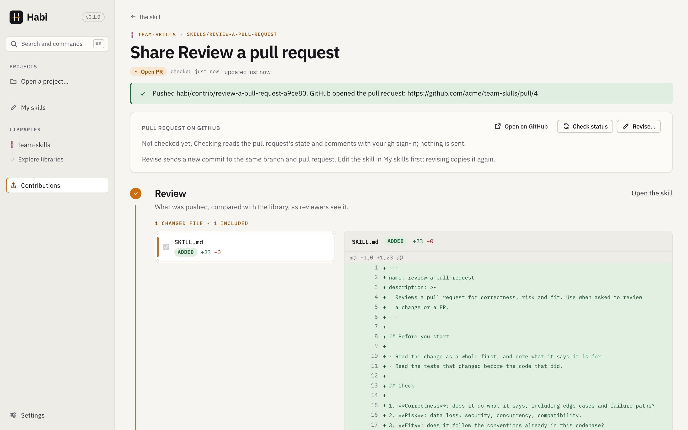
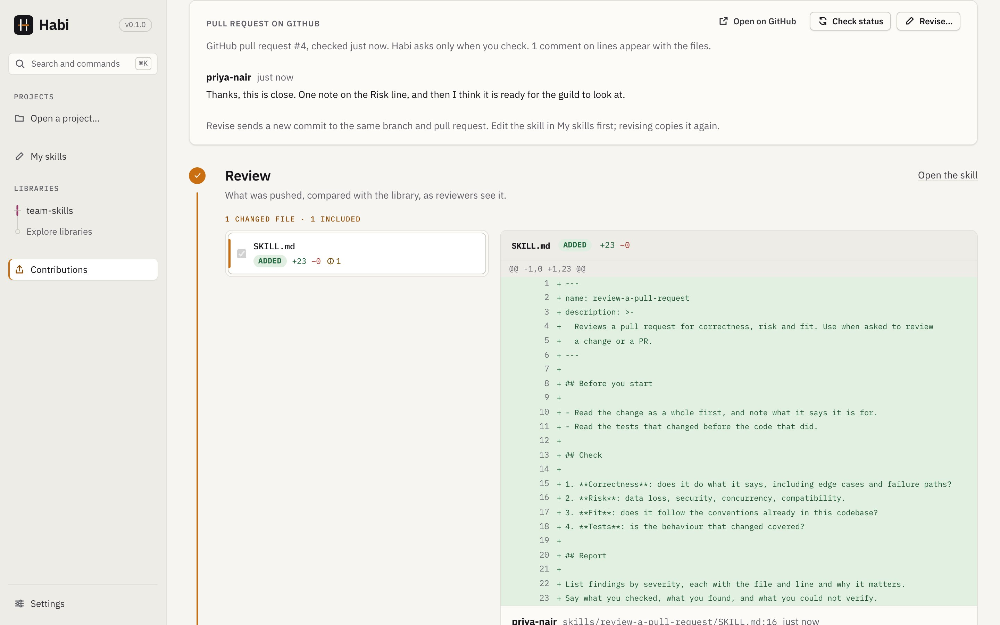
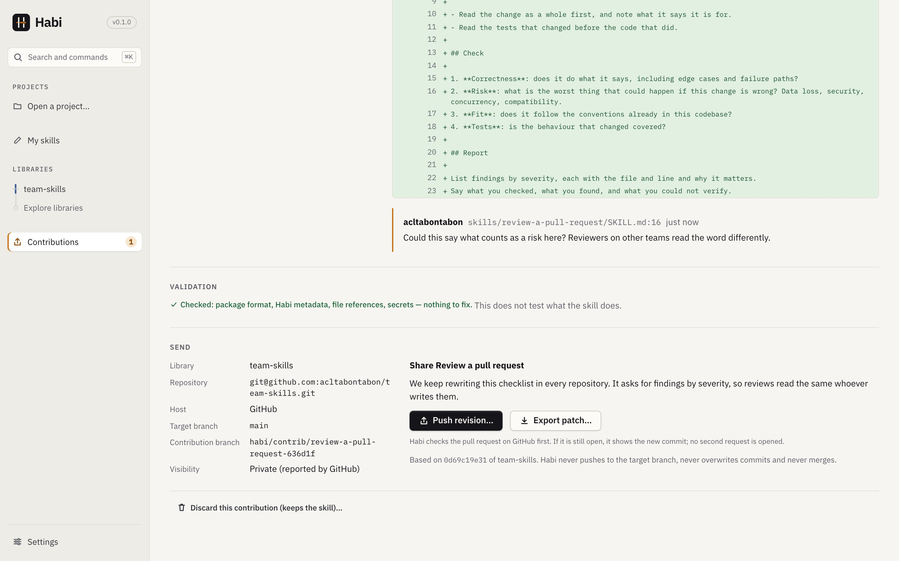
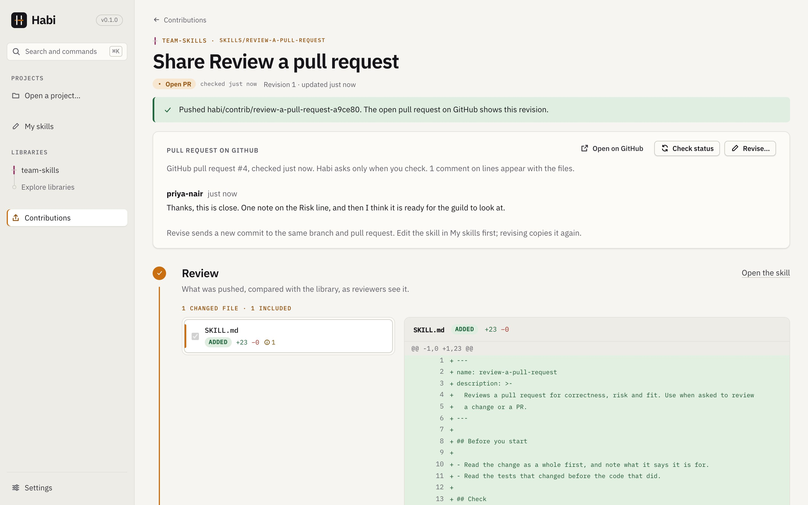

# Sharing

Sharing sends a skill you wrote or improved to your team's library as a pull request (or merge
request), so the people who keep the library can review it. Habi prepares the change and shows
you every file before anything leaves your machine. The Git host, not Habi, decides what gets
merged.

Sharing is one of three separate actions, never mixed:

| Action | What it does | What it changes |
|---|---|---|
| **Refresh a library** | Fetches what the library holds now | Nothing in a project |
| **Update an installed item** | Applies a library change to a project, through a preview | The project, after you confirm |
| **Contribute** (this page) | Prepares a change for the library's maintainers | Nothing until you send it |

**You need** a library that is a Git repository (a remote, or a clone on this machine), and Git
to know your name and email (`git config --global user.name` and `user.email`). To open the
pull request from Habi, install and sign in to [`gh`](https://cli.github.com) for GitHub or
`glab` for GitLab. Without them Habi still pushes the branch, and you open the request
yourself.

The steps below follow one skill from your draft to a merged review. The screenshots are from a
GitHub repository; GitLab reads the same.

## Share a skill

### 1. Connect your team's library

Once per library. In **Connect a library**, choose *Connect a Git repository* and paste its
address. Habi reads the host and repository from it, follows the default branch unless you pick
another, and lists it as your team's library. Habi uses the Git credentials already set up on
this machine.

You can also do this from the share dialog in the next step.

### 2. Share the skill

Open the skill in **My skills** and choose **Share**. Pick the library; if the skill came from a
library, that one is offered first.

Nothing is sent from here. If you have no Git library, **Export as zip…** writes the skill as a
standard package you can send or commit anywhere. Exporting is not sharing: nobody has received
it yet.

If the skill already has a contribution still going to this library, the dialog offers
**Continue sharing** (which sends your latest edits as a revision of the same request) beside
*Start a new contribution*.

### 3. Review what will leave your machine

The contribution page opens with **every file compared with the library**: each is *added*,
*modified*, *renamed*, *removed* or *unchanged*. Changed files come first, beside the diff of
the one you select.

- **Leave a file out.** Untick a changed file and it keeps the library's version: a left-out
  addition is not added, a left-out removal stays. A new skill cannot leave out its `SKILL.md`.
- **Validation** covers exactly what would be sent: package format, Habi metadata, file
  references and a scan for secrets. An error stops you from preparing the branch; a warning
  does not. Passing validation does not test what the skill does.

### 4. Tell the reviewer why

Under **Send**, the page shows where the change is going: the library, repository, host, target
branch and the contribution branch Habi will create. *Visibility* reads "Unknown — not checked"
until the host has reported it, because Habi does not ask the network just to show the page.

Give the contribution a title and say why you are sharing it. This becomes the description of
the request.

**Add where it applies…** adds a short summary to your message: which of the projects you
opened in Habi the skill applies to, by name only (never paths), and how many it does not apply
to. Sample projects are not counted. It is ordinary text: edit or remove it before you
continue.

### 5. Prepare the branch

**Prepare branch** commits the files you included to `habi/contrib/<name>-<id>`, inside Habi's
own copy of the library. Your checkouts and branches are not touched, and no hooks or filters
run. Preparing again returns the same commit on the same branch. Nothing has been sent yet.

- **Create pull request…** (GitHub), **Create merge request…** (GitLab) or **Push branch…**
  when the matching tool is not installed. The button says what will happen.
- **Export patch…** writes a `git format-patch` file with every commit of the contribution
  since the library snapshot it started from, so it applies with `git am`. Use it when you
  have no push access, as with most community libraries.

### 6. Send it

The confirmation lists the library, repository, host, target branch, contribution branch and
the files that will be sent. Nothing is pushed until you confirm.

Habi pushes the contribution branch with your Git credentials. If `gh` or `glab` is installed
and signed in, it then opens the request against the target branch. A request opened by hand on
the host is found too, by its source branch. For a library that is a repository on this
machine, Habi creates the branch there with a hook-free `git fetch` instead of a push.

If anything fails, the contribution says **Needs attention** with the message. Retrying is
safe: the branch name is fixed per contribution, a push never overwrites commits, and a request
is opened only when the host does not already show one.

### 7. Follow the review

Habi does not poll. Choose **Check status** when you want to know. It reads the request
through `gh api` or `glab api` and shows its state (open, draft, changes requested, approved,
merged or closed), who approved, and the comments, with the time it last checked.

- Comments on a line appear beside that file's diff; the rest are listed in **Review**. Replying,
  resolving and merging stay on the host.
- Comments are written by other people, so they are shown as plain text only: no Markdown, no
  HTML, no links followed, with control characters removed and lengths bounded. Habi reads up
  to 200 and says when more exist.
- **Approved** means a reviewer approved. Merging is still up to the maintainers and the
  host's rules.

### 8. Revise after review

Edit the skill in **My skills**, then return to the contribution and choose **Revise…**. Habi
copies the skill again, you **Prepare the revision**, and **Push revision…** adds a new commit
to the same branch.

Before pushing, Habi checks the request on the host. If it is still open, it shows the new
commit and no second request is opened.

If the request was merged or closed, it cannot be revised: share the skill again as a new
contribution. More about revising is under [Revising in detail](#revising-in-detail).

## What Habi never does

- It never merges, and never pushes to the branch your team tracks.
- It never overwrites commits on the contribution branch.
- It never reports a remote success it did not observe.
- It never sends anything you have not confirmed, and never collects conversations or files
  other than the skill's own folder.

Git hosts decide who may push, whether branches are protected and who must review. The
configured source and ref are the team's chosen baseline; Habi does not label every commit
"approved". A library item's `owner` field is attribution only.

## Contribution states

The **Contributions** page lists one row per contribution, with one state, "checked … ago" for
states the host reported, the destination (library and branch), the last update and one next
action: *Continue editing*, *Review changes*, *Retry* or *Open PR/MR*. Pending contributions are
listed apart from approved library content.

| State | What happened |
|---|---|
| Draft | A staged copy exists on this machine. Nothing else. |
| Ready to submit | A commit exists on the contribution branch in Habi's own copy of the library. Nothing was sent. A patch may have been exported; sending it is up to you. |
| Branch pushed | The branch is on the remote, and no pull or merge request was opened (the reason is shown). |
| Open PR / Open MR | `gh` or `glab` opened a request, or the host shows one for the branch. |
| Changes requested, Merged, Closed | What the host reported when Habi last checked. |
| In the library | After a refresh, the library's tracked branch contains exactly the contributed files. |
| Needs attention | The last prepare or send failed; the message says why. |

Discarding a contribution removes its staged files and local branch; it can no longer be
prepared, exported, sent or checked. A request already open on the host stays open; close it
there.

## Reference

### What is copied

Habi copies only the chosen folder into a private staging area in its data folder. Nothing else
is collected. Files the operating system leaves in folders (`.DS_Store`, `Thumbs.db`,
`desktop.ini`) are skipped. The contribution names its staging folder (`stagingPath`); a
library-item contribution's files are edited there.

A contribution from My skills is a snapshot of the skill when sharing started. If a skill you
share under a new name matches a library skill it was not copied from, the review warns that
the contribution replaces that skill's files.

### Other things you can share

Besides a skill from My skills, the **Contributions** page (*Share an installed copy you
edited, or improve a library item*) starts a contribution from:

- a skill folder in one of your projects, such as the installed copy you improved;
- an existing library item whose metadata you want to improve.

For these, a form covers title, owner, where it applies (tags, dependencies, file patterns,
all/any), exclusions, prerequisite commands, examples and repository scope. Tags detected in
your project are offered as suggestions; you decide. The form writes `habi.yaml` (or the
skill's existing `habi.yml`).

- Only what you changed is written: saving an unchanged form leaves the file byte for byte as
  it was.
- A change keeps key order, unknown keys, explicit defaults such as `scope: module`, the
  exclusion mode (`all`/`any`) and fields the form does not show (a tool's `purpose` and
  `install_hint`, an example's `path`).
- Comments other than the file's leading ones are lost when it is rewritten.
- Conditions richer than the form can express are kept unchanged.

For a skill from My skills the rules come from the skill itself; change them in
[My skills](my-skills.md#sharing).

### Checks on the files

A Markdown file that links to, or names in inline code (like `scripts/check.sh`), a package
file the contribution leaves out, deletes or renames is an error naming both files. A *renamed*
file is a removed and an added path with identical content. Unchanged files are one collapsed
group.

### Revising in detail

- **Only a version that was sent counts.** Revising it makes revision *n* ("Revision *n* after
  review." in the commit message); reopening a prepared-but-unsent version does not.
- **Where the files come from.** A skill from My skills or a project is copied again from where
  it lives, and again when you prepare, so edits made there after *Revise* are included. Form
  changes made in Habi since are reapplied. A library-item contribution reopens its form and
  staging folder.
- **Prepare** adds a commit on top of the one you sent, on the same branch. A revision that
  changes nothing is refused ("Nothing changed since the version you sent").
- **Cancel revision** returns to the version you had before *Revise* (same commit, state,
  title, message, form and staged files).
- **If Habi cannot check the host**, revising is allowed and the page says the request was not
  checked. After pushing it says the branch was pushed and that the request, if still open,
  shows it, never that it updated the request.
- **If someone else pushed to the branch** since (for example a reviewer's suggestion), Habi
  stops and changes nothing. You can choose **Build on their commits**: their commits stay in
  the history, and the skill folder then holds exactly the files you staged.
- **Before preparing**, Habi fetches the contribution branch. Only a branch that no longer
  exists ("couldn't find remote ref", for example merged and deleted) lets the revision
  recreate it; network, sign-in and other failures stop with the error, because Habi cannot
  tell whether someone else pushed.
- **Status checks** run `gh` and `glab` in an empty folder in Habi's data directory, never in
  whatever repository Habi was started from. All reviews are read to decide the state.

### Git hosts

| | GitHub | GitLab |
|---|---|---|
| Open a request | `gh pr create --repo host/owner/repo` | `glab mr create --repo https://host/group/…/repo` (full URL, so nested groups work) |
| Status and comments | `gh api` REST: pulls, reviews, issue and review comments | `glab api` REST: merge requests, approvals, discussions |
| "Changes requested" | From each reviewer's latest review | Not reported (GitLab has no equivalent in the REST API Habi uses); approvals are |
| Self-hosted | Recognized when `gh auth status --hostname` succeeds | Recognized when `glab auth status --hostname` succeeds |

`github.com` and host names containing `github`/`gitlab` are recognized by name; other hosts by
whichever tool is signed in to them.

**How far this has been tried.** The GitHub path was run end to end against a live private
repository for this guide's screenshots: connecting it, preparing and sending a contribution,
`gh` opening the pull request, reading its state and its line and general comments, and pushing
a revision to the open request. Approvals, *changes requested*, merged and closed requests, and
self-hosted hosts have not been run live; they are covered with a real Git and a stand-in `gh`
in `tests/review_flow.rs`. GitLab is covered only through a stand-in `glab` in
`tests/review_requests.rs`, and has not been run against a live host.

### Requirements

- The library must be a Git source (remote or local clone). Folder sources cannot receive
  contributions; export the skill as a zip instead.
- Git must know your name and email.
